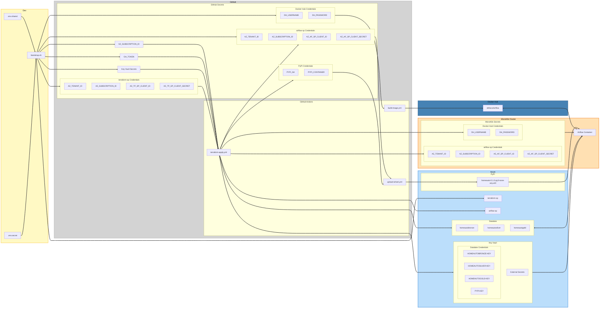

```mermaid
graph LR
%% ────────────────
%% Dev Environment
%% ────────────────
    subgraph dev[Dev]
        env_shared[.env.shared]
        env_secret[.env.secret]
        bootstrap[bootstrap.sh]
        env_shared --> bootstrap
        env_secret --> bootstrap
    end
    classDef dev fill: #fff9c4, stroke: #fbc02d, stroke-width: 2px, color: #000
    class dev dev
%% ────────────────
%% GitHub Environment
%% ────────────────
    subgraph github[GitHub]
        subgraph github_secrets[GitHub Secrets]
            az_subscription_id[AZ_SUBSCRIPTION_ID]
            gh_token[GH_TOKEN]
            kv_secrets[Key Vault Secrets]

            subgraph az_sp_tf_creds[terraform-sp Credentials]
                az_tenant_id_tf[AZ_TENANT_ID]
                az_subscription_id_tf[AZ_SUBSCRIPTION_ID]
                az_sp_tf_client_id[AZ_TF_SP_CLIENT_ID]
                az_sp_tf_client_secret[AZ_TF_SP_CLIENT_SECRET]
            end

            subgraph az_sp_af_creds[airflow-sp Credentials]
                az_tenant_id_af[AZ_TENANT_ID]
                az_subscription_id_af[AZ_SUBSCRIPTION_ID]
                az_sp_af_client_id[AZ_AF_SP_CLIENT_ID]
                az_sp_af_client_secret[AZ_AF_SP_CLIENT_SECRET]
            end

            subgraph docker_hub_creds[Docker Hub Credentials]
                dh_username[DH_USERNAME]
                dh_password[DH_PASSWORD]
            end

            subgraph pypi_creds[PyPI Credentials]
                pypi_sa[PYPI_SA]
                pypi_container[PYPI_CONTAINER]
            end

        end

        subgraph github_actions[GitHub Actions]
            terraform_apply[terraform-apply.yml]
            upload_wheel[upload-wheel.yml]
            build_image[build-image.yml]
        end

    %% Dependencies
        bootstrap --> gh_token
        bootstrap --> az_sp_af_creds
        bootstrap --> docker_hub_creds
        bootstrap --> kv_secrets
        bootstrap --> az_sp_tf_creds
        bootstrap --> az_subscription_id
        az_subscription_id --> terraform_apply
        gh_token --> terraform_apply
        kv_secrets --> terraform_apply
        az_sp_tf_creds --> terraform_apply
        terraform_apply --> pypi_creds
        terraform_apply --> az_sp_af_creds
        az_sp_af_creds --> upload_wheel
        docker_hub_creds --> build_image
        pypi_creds --> upload_wheel
    end
    classDef github fill: #d3d3d3, stroke: #A9A9A9, stroke-width: 2px, color: #000
    class github github
%% ────────────────
%% Azure
%% ────────────────
    subgraph azure[Azure]
        terraform_sp[terraform-sp]
        airflow_sp[airflow-sp]

        subgraph keyvault[Key Vault]
            external_secrets_kv[External Secrets]

            subgraph datalake_creds_kv[Datalake Credentials]
                bronze_key_kv[HOMEAUTOBRONZE-KEY]
                silver_key_kv[HOMEAUTOSILVER-KEY]
                gold_key_kv[HOMEAUTOGOLD-KEY]
                pypi_key_kv[PYPI-KEY]
            end
        end

        subgraph pypi[PyPI]
            wheel[homeauto-0.1.0-py3-none-any.whl]
        end

        subgraph datalake[Datalake]
            bronze[homeautobronze]
            silver[homeautosilver]
            gold[homeautogold]
        end

        bootstrap --> terraform_sp
        terraform_apply --> airflow_sp
        terraform_apply --> datalake
        terraform_apply --> keyvault
        upload_wheel --> wheel
    end
    classDef azure fill: #bbdefb, stroke: #1976d2, stroke-width: 2px, color: #000
    class azure azure
%% ────────────────
%% Docker Hub
%% ────────────────
    subgraph DockerHub[Docker Hub]
        build_image --> afelaco_airflow[afelaco/airflow]
    end
    classDef docker fill: #4682B4, stroke: #2C5C8A, stroke-width: 2px, color: #000
    class DockerHub docker
%% ────────────────
%% MicroK8s Cluster
%% ────────────────
    subgraph MicroK8s[MicroK8s Cluster]
        airflow_container[Airflow Container]

        subgraph microk8s_secrets[MicroK8s Secrets]

            subgraph az_sp_af_creds_prod[airflow-sp Credentials]
                az_tenant_id_af_prod[AZ_TENANT_ID]
                az_subscription_id_af_prod[AZ_SUBSCRIPTION_ID]
                az_sp_af_client_id_prod[AZ_AF_SP_CLIENT_ID]
                az_sp_af_client_secret_prod[AZ_AF_SP_CLIENT_SECRET]
            end

            subgraph docker_hub_creds_prod[Docker Hub Credentials]
                dh_username_prod[DH_USERNAME]
                dh_password_prod[DH_PASSWORD]
            end

        end

        terraform_apply --> az_sp_af_creds_prod
        terraform_apply --> docker_hub_creds_prod
        microk8s_secrets --> airflow_container
        datalake <--> airflow_container
        keyvault --> airflow_container
        wheel --> airflow_container
        afelaco_airflow <--> airflow_container


    end
    classDef microk8s fill: #ffe0b2, stroke: #ef6c00, stroke-width: 2px, color: #000
    class MicroK8s microk8s
%% Make all arrows dark gray
    linkStyle default stroke: #333, stroke-width: 3px
```
